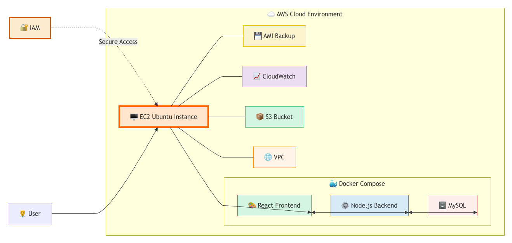

# Public Health Disease Surveillance Cloud

Cloud-based Disease Surveillance Platform deployed on AWS using React, Node.js, Express, MySQL, Docker, and AWS Services.

---

## 📖 Project Overview

The Public Health Disease Surveillance Cloud project is a cloud-native healthcare monitoring platform developed to demonstrate practical implementation of AWS Cloud Computing concepts. The platform provides a centralized environment for disease surveillance while showcasing cloud infrastructure design, networking, Linux administration, monitoring, backup strategies, containerization, and secure application deployment.

The application is hosted on Amazon EC2 and deployed using Docker Compose with separate containers for the frontend, backend, and database services.

---

## 🎯 Objectives

* Design a secure AWS cloud infrastructure.
* Deploy a production-ready web application.
* Demonstrate AWS networking concepts.
* Implement Linux administration tasks.
* Deploy containerized services using Docker.
* Monitor infrastructure using CloudWatch.
* Utilize Amazon S3 cloud storage.
* Implement backup and disaster recovery using AMI.
* Apply security and cost optimization practices.

---

## 🏗️ System Architecture

  

The Public Health Disease Surveillance Cloud platform is deployed on AWS infrastructure using a containerized architecture. The solution consists of an Amazon EC2 instance hosted inside a Virtual Private Cloud (VPC) and deployed using Docker Compose.

The application is divided into three core services:

* Frontend (React + Vite)
* Backend (Node.js + Express)
* MySQL Database

AWS services such as IAM, S3, CloudWatch, and AMI are integrated to provide secure access management, cloud storage, monitoring, and backup capabilities. Networking components including VPC, Subnet, Internet Gateway, Route Table, and Security Groups ensure secure communication and controlled access to the application.

---

## 🛠️ Technology Stack

### Frontend

* React.js
* Vite
* HTML5
* CSS3
* JavaScript

### Backend

* Node.js
* Express.js

### Database

* MySQL

### Cloud & Infrastructure

* AWS EC2
* AWS IAM
* AWS VPC
* AWS S3
* AWS CloudWatch
* AWS AMI

### Deployment

* Docker
* Docker Compose
* Ubuntu Linux

---

## ☁️ AWS Services Used

| AWS Service      | Purpose               |
| ---------------- | --------------------- |
| IAM              | Access Management     |
| VPC              | Network Isolation     |
| Subnet           | Network Segmentation  |
| Internet Gateway | Internet Connectivity |
| Route Table      | Traffic Routing       |
| Security Group   | Firewall Protection   |
| EC2              | Application Hosting   |
| S3               | Cloud Storage         |
| CloudWatch       | Monitoring & Alerts   |
| AMI              | Backup & Recovery     |

---

## 📸 Implementation Screenshots

### IAM User Creation

### VPC Creation

### Public & Private Subnets

### Internet Gateway Configuration

### Route Table Configuration

### Security Group Configuration

### EC2 Instance Creation

### SSH Connectivity

### Linux User Creation

### Linux Groups Management

### Linux File Permissions & Ownership

### Repository Cloning

### Docker Installation

### Docker Compose Installation

### Multi-Container Deployment

### Cron Job Configuration

### Linux Monitoring

### Application Deployment

### Amazon S3 Bucket

### CloudWatch Monitoring

### AMI Backup Creation

---

## ⚡ Challenges Faced

### Docker Build Context Issue

The frontend image initially failed to build because Docker could not access files outside the build context. The Dockerfile was updated to correctly reference the Nginx configuration file.

### Docker Compose Compatibility Issue

The older Docker Compose version was incompatible with the installed Docker Engine version. Upgrading to Docker Compose v2 resolved the deployment issue.

### CORS Configuration Issue

Frontend API requests were blocked due to an incorrect CORS configuration. The allowed origin was updated to match the deployed EC2 endpoint, restoring communication between frontend and backend services.

---

## 💰 Cost Optimization

* Stop EC2 instances when not in use.
* Use S3 for scalable and cost-efficient storage.
* Utilize Docker containers for efficient resource usage.
* Monitor resources using CloudWatch.
* Maintain AMI backups for disaster recovery.
* Use a single EC2 instance during development and testing to reduce infrastructure costs.

---

## 📚 Learning Outcomes

Through this project, practical experience was gained in:

* AWS Cloud Infrastructure Design
* Cloud Networking Concepts
* Linux Administration
* Docker & Containerization
* Cloud Monitoring & Logging
* Cloud Storage Services
* Backup & Disaster Recovery
* Real-World Deployment Troubleshooting
* Secure Cloud Application Hosting

---

## Conclusion

The Public Health Disease Surveillance Cloud project successfully demonstrates the practical implementation of AWS Cloud Computing concepts including networking, security, monitoring, storage, backup, Linux administration, Docker containerization, and cloud deployment. The project provided hands-on experience with real-world AWS infrastructure and deployment practices while showcasing a complete cloud-native application architecture.
