# Public Health Disease Surveillance Cloud

A cloud-based Public Health Disease Surveillance Platform deployed on AWS Cloud. The project demonstrates practical implementation of AWS cloud services, networking, Linux administration, containerization, monitoring, backup strategies, and cloud deployment best practices.

---

# Project Overview

The Public Health Disease Surveillance Cloud platform provides a centralized system for monitoring and managing disease-related information. The application is deployed on AWS infrastructure using Docker containers and follows cloud computing best practices for scalability, security, monitoring, and disaster recovery.

---

# Technology Stack

## Frontend

* React.js
* Vite
* HTML5
* CSS3
* JavaScript

## Backend

* Node.js
* Express.js

## Database

* MySQL

## Cloud & Infrastructure

* AWS EC2
* AWS VPC
* AWS IAM
* AWS S3
* AWS CloudWatch
* AWS AMI

## DevOps & Deployment

* Docker
* Docker Compose
* Linux (Ubuntu Server)
* Git & GitHub

---

# AWS Services Used

| Service          | Purpose                |
| ---------------- | ---------------------- |
| IAM              | Access Management      |
| VPC              | Network Isolation      |
| Subnet           | Network Segmentation   |
| Internet Gateway | Internet Connectivity  |
| Route Table      | Traffic Routing        |
| Security Group   | Firewall Configuration |
| EC2              | Application Hosting    |
| S3               | Cloud Storage          |
| CloudWatch       | Monitoring & Alerting  |
| AMI              | Backup & Recovery      |

---

# Application Architecture


---

# Project Features

* Disease Surveillance Dashboard
* Public Health Data Management
* Cloud-Based Deployment
* Containerized Architecture
* Secure AWS Networking
* Role-Based Access Control
* Cloud Monitoring
* Backup & Recovery Strategy
* Cost Optimization Practices

---

# AWS Infrastructure Setup

The following AWS components were configured:

* IAM User
* VPC
* Public Subnet
* Internet Gateway
* Route Table
* Security Group
* EC2 Instance
* S3 Bucket
* CloudWatch Alarm
* AMI Backup

---

# Deployment Process

### Clone Repository

```bash
git clone https://github.com/Whatisthissam/PublicHealth-Disease-Surveillance-Cloud.git
cd PublicHealth-Disease-Surveillance-Cloud
```

### Start Application

```bash
docker compose up -d --build
```

### Verify Containers

```bash
docker ps
```

### Access Application

```text
http://<EC2-Public-IP>
```

---

# Implementation Screenshots

## IAM User Creation

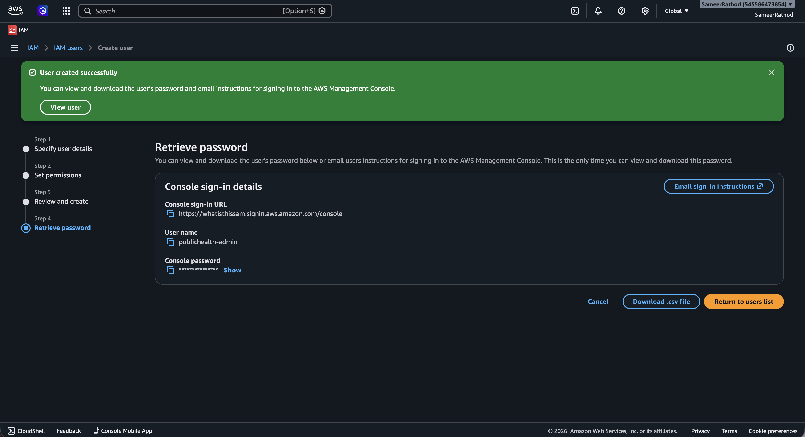

---

## VPC Creation

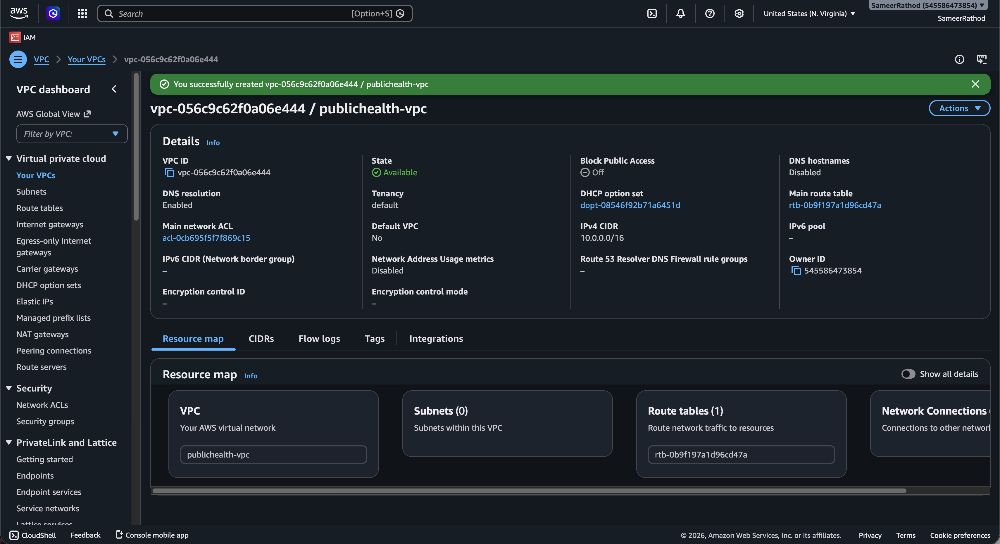

---

## Public & Private Subnets

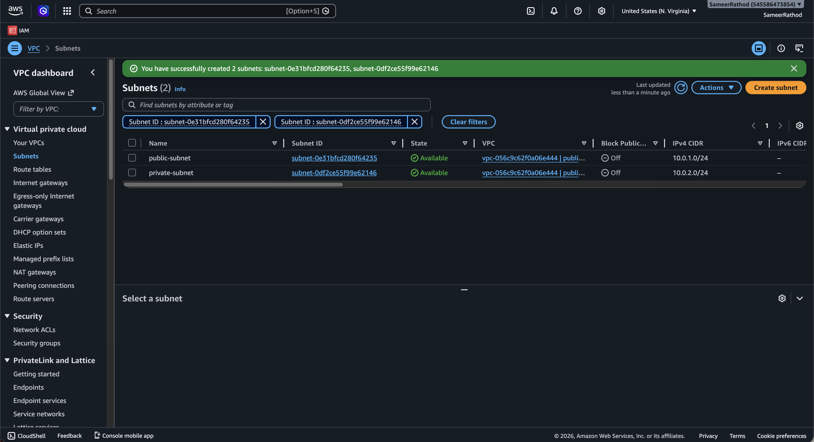

---

## Internet Gateway Configuration

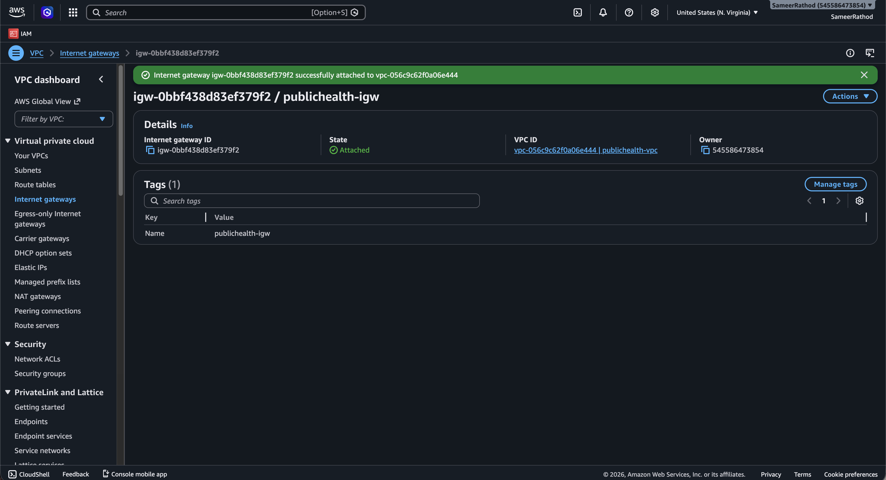

---

## Route Table Configuration

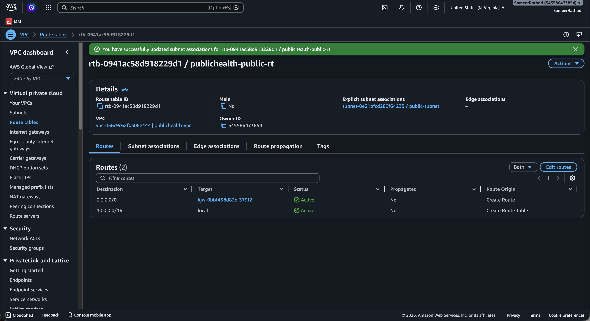

---

## Security Group Configuration

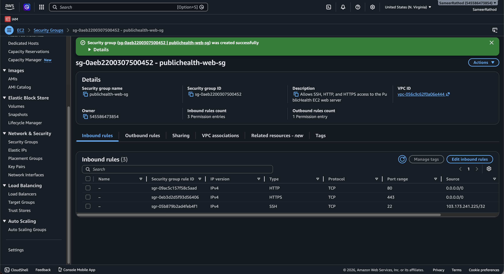

---

## EC2 Instance Creation

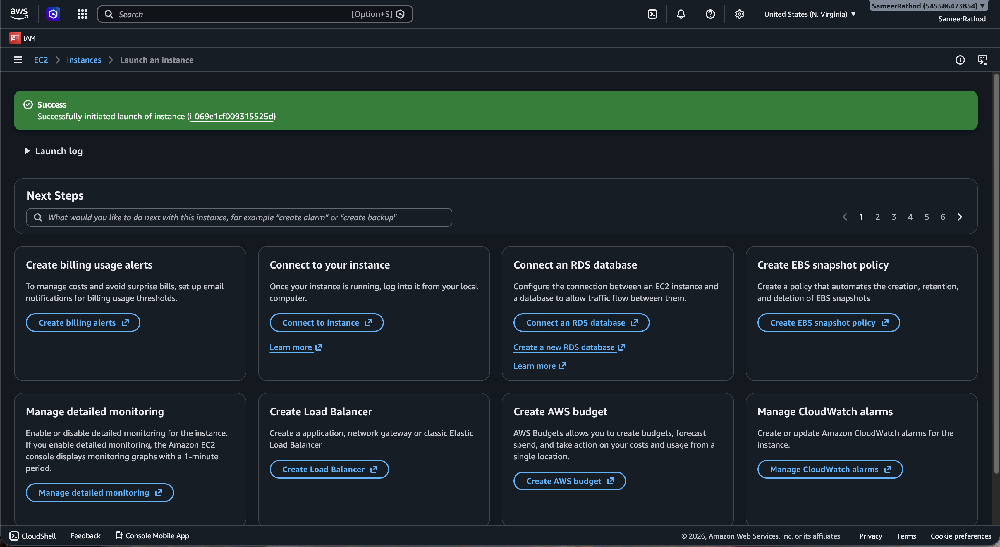

---

## SSH Connectivity

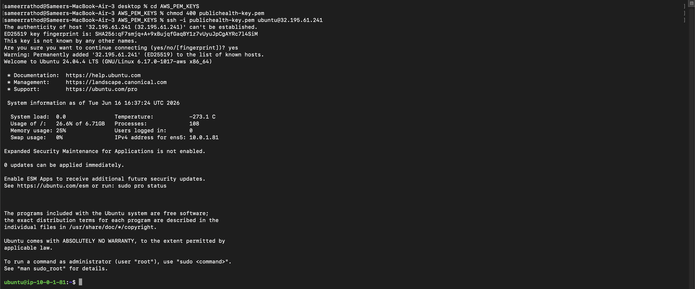

---

## Linux User Creation

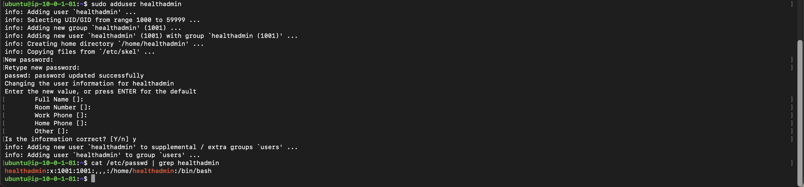

---

## Linux Groups Management

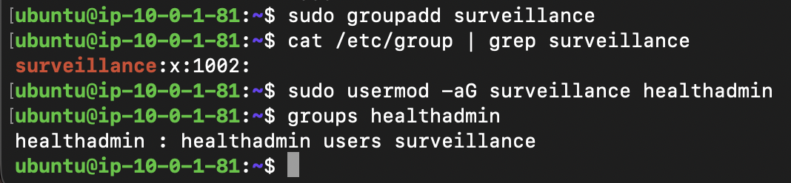

---

## Linux File Permissions

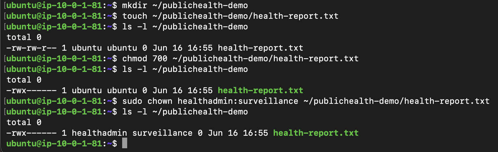

---

## Repository Cloning

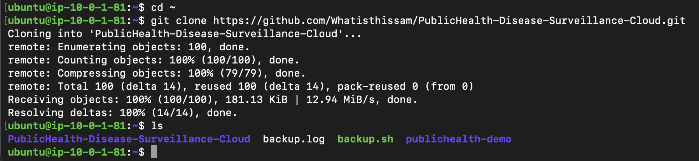

---

## Docker Installation

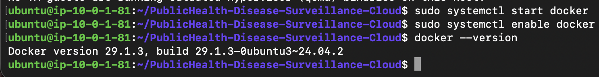

---

## Docker Compose Installation

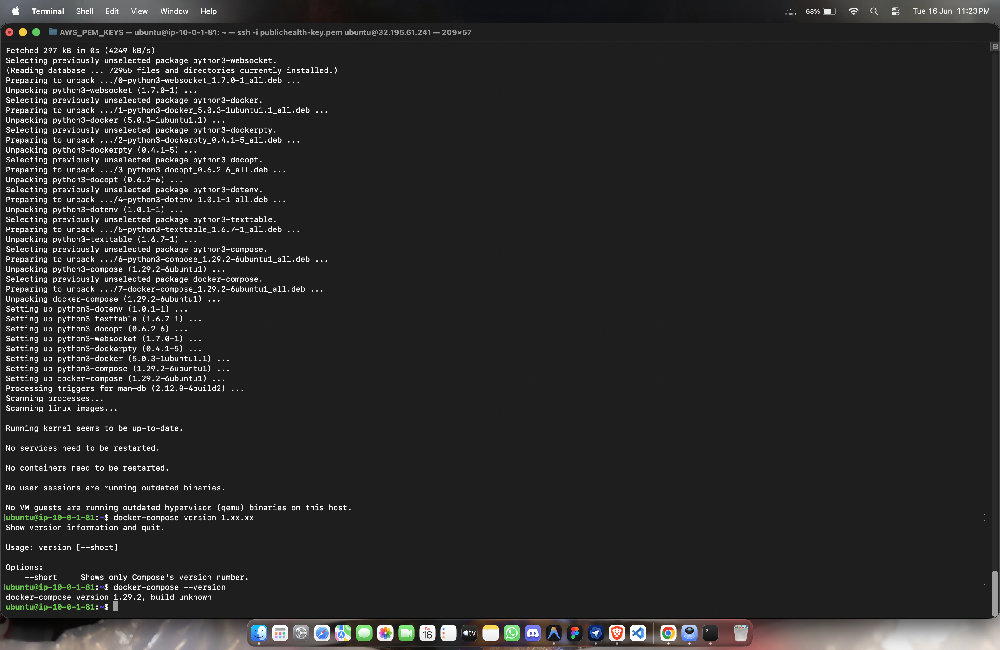

---

## Multi-Container Deployment

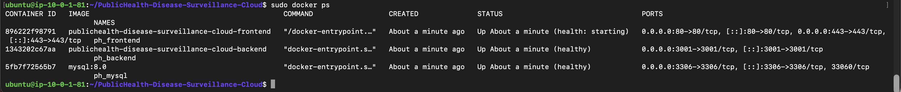

---

## Cron Job Configuration

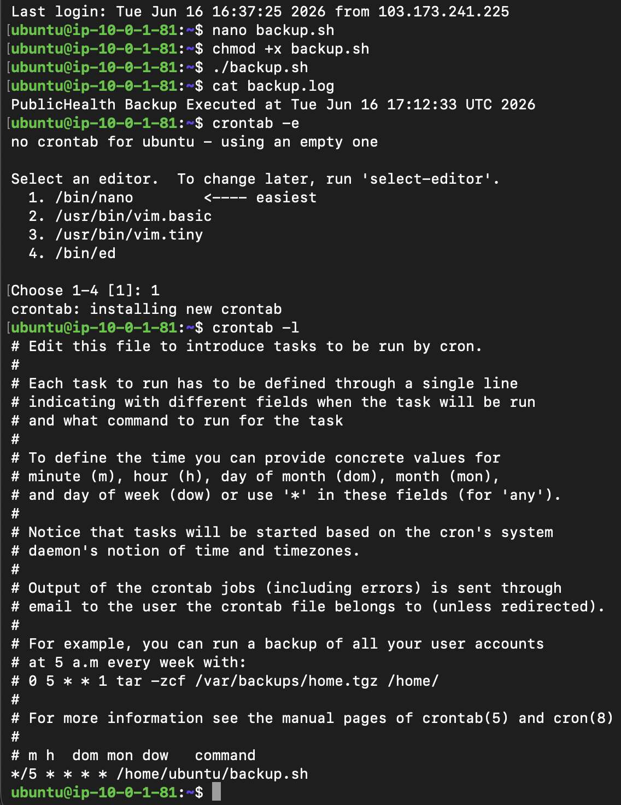

---

## Linux Monitoring

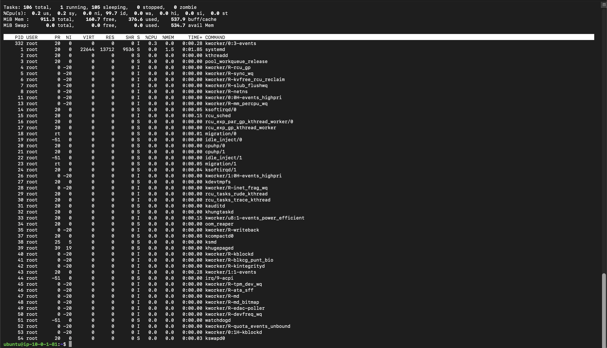

---

## Website Deployment

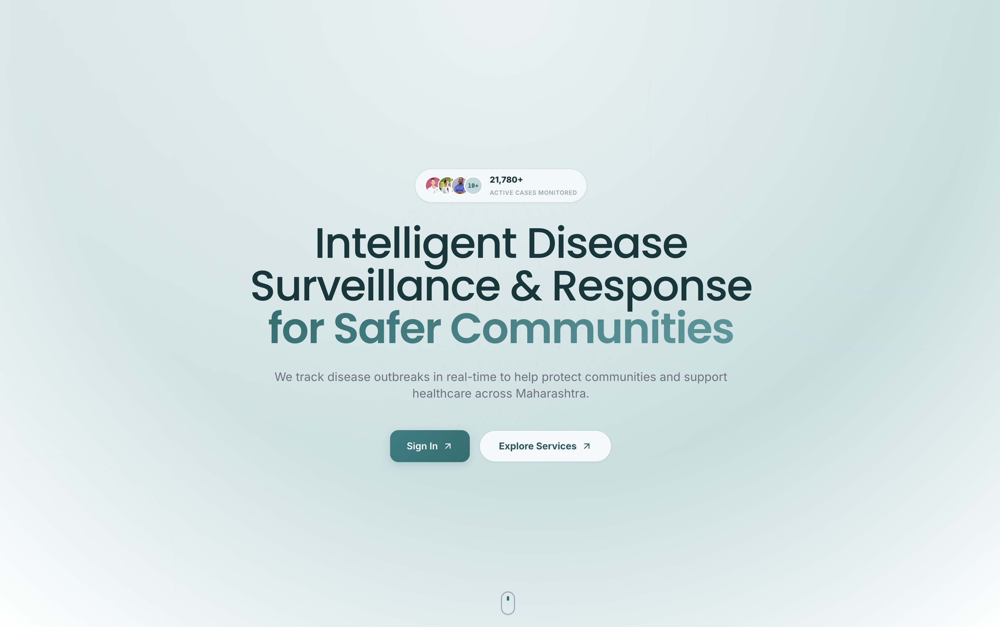

---

## Amazon S3 Bucket

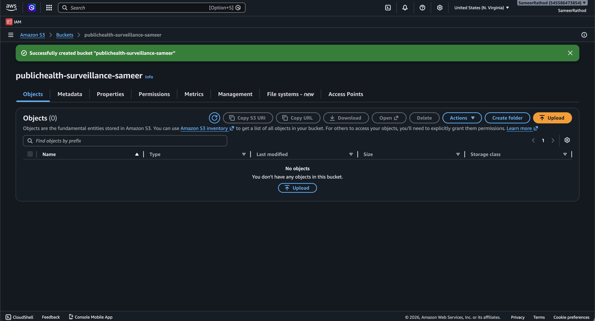

---

## CloudWatch Alarm

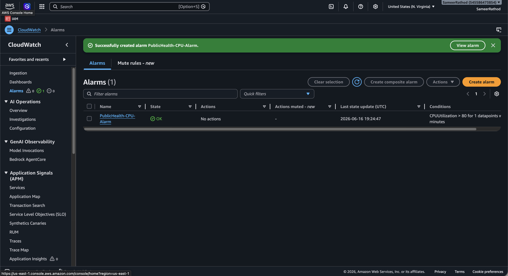

---

## AMI Backup Creation

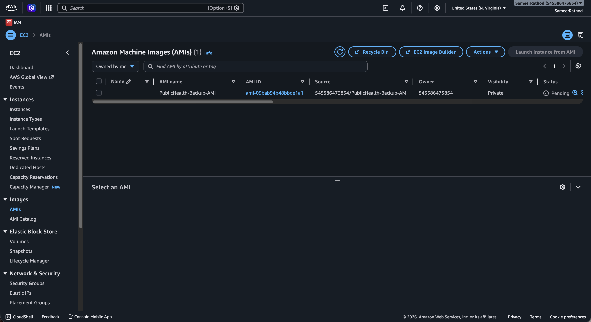

---

# Challenges Faced

### Docker Build Context Issue

The frontend Docker image initially failed to build because Docker could not access files outside the build context. The Dockerfile was updated to correctly reference the Nginx configuration file.

### Docker Compose Compatibility Issue

The older Docker Compose version was incompatible with the installed Docker Engine version. Upgrading to Docker Compose v2 resolved the deployment issue.

### CORS Configuration Issue

Frontend API requests were blocked due to an incorrect CORS configuration. The allowed origin was updated to match the deployed EC2 public endpoint, restoring communication between frontend and backend services.

---

# Cost Optimization

* EC2 instances can be stopped when not in use.
* S3 provides cost-efficient cloud storage.
* Docker containers optimize resource utilization.
* CloudWatch helps monitor resource consumption.
* AMI backups reduce disaster recovery costs.

---

# Conclusion

The Public Health Disease Surveillance Cloud project successfully demonstrates the practical implementation of AWS Cloud Computing concepts including networking, security, monitoring, storage, backup, Linux administration, Docker containerization, and cloud deployment. The project provides hands-on experience with real-world cloud infrastructure and deployment practices.
